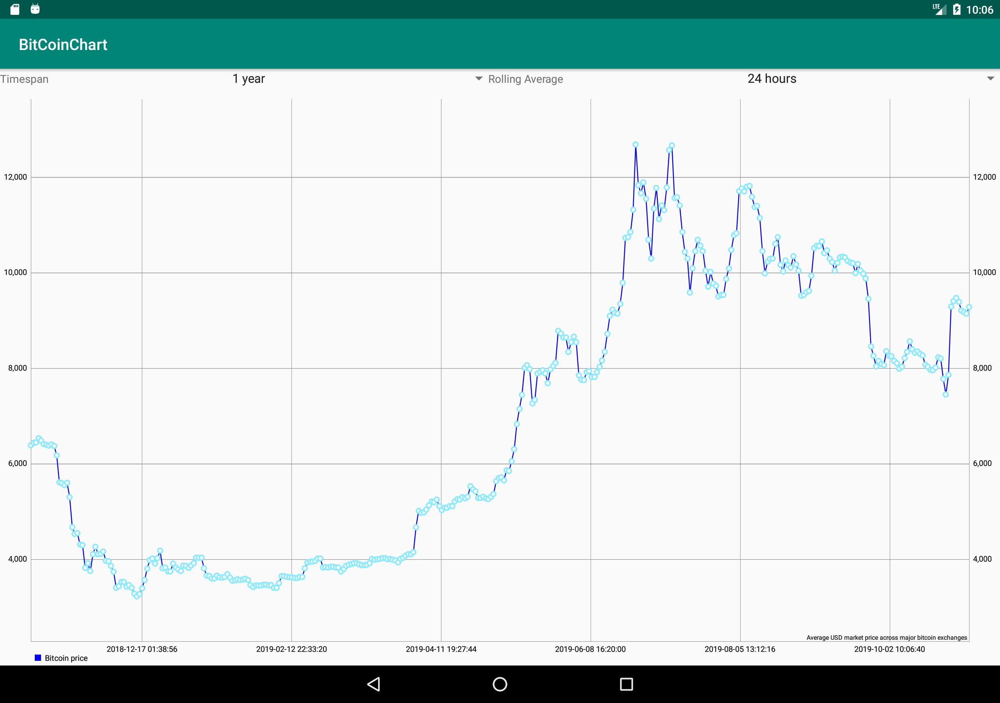
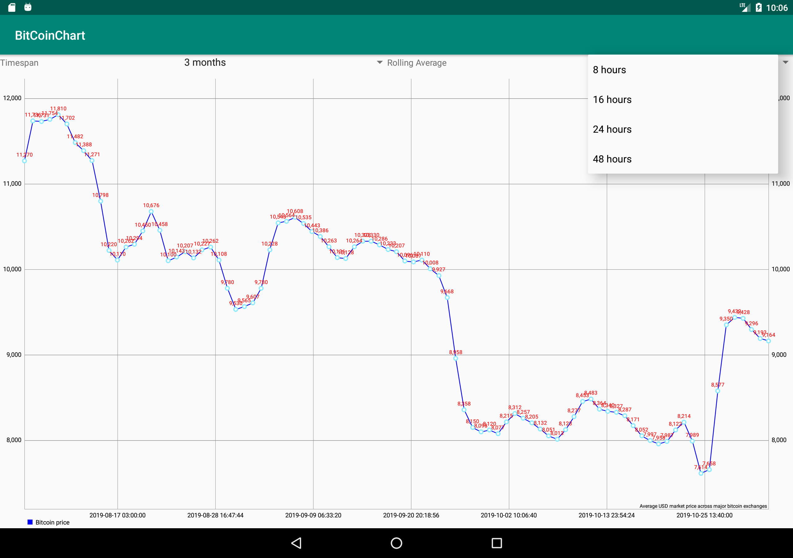

# BitCoinChart

An app that displays the price of bitcoin and allows you to filter by timespan and rolling average.

Language:

- Kotlin

Libraries used:

- RxJava2, RxAndroid for handling streams of data and multithreading

- Android architecture components (Viewmodel)

- MPAndroidChart to display the graph

- Mockito to mock dependencies

- Junit to run unit tests

- Dagger2 for dependency injection

Architecture:

Clean Architecture with a data, domain and presentation layer. Each layer has it's own gradle module.
On the domain and data layer we only have a Single returned. On the presentation is where we have subscription to the single
hence creating a unidirectional flow within the reactive architecture. Data is only consumed by the presentation layer, data is fetched on the data layer
and if there are business rules they will be handled by usecases in the domain layer.

On the presentation layer MVVM is used to separate concerns and enable testing of implementation details in the view model

